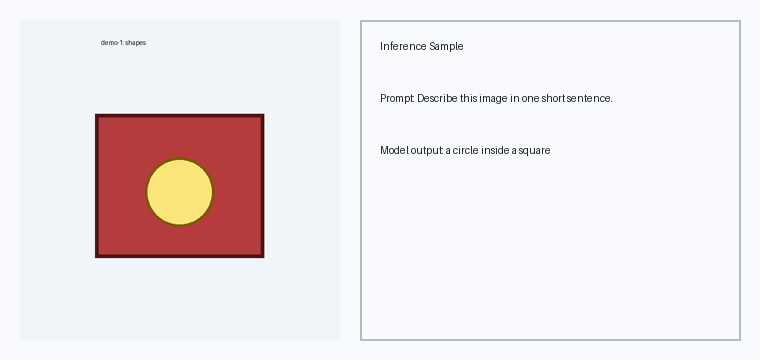
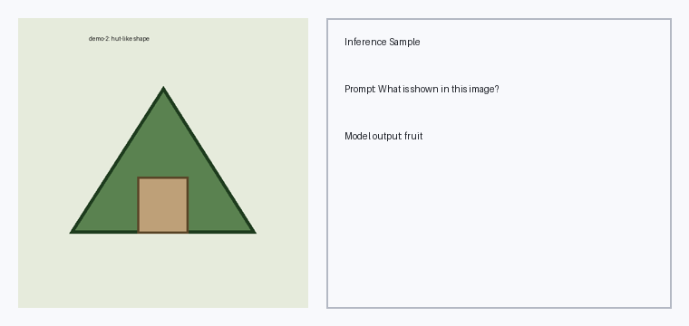

# VLM

Minimal PaliGemma vision-language project with:

- local multimodal inference from downloaded weights
- a custom `PaliGemmaProcessor` implementation
- core Gemma and SigLIP model components in `src/`
- unit tests for processor, config validation, KV cache, and model layers

## What is in this repository

- `inference.py`: CLI for running local PaliGemma inference from `paligemma-weights/`.
- `src/paligemma_processor.py`: custom image + text processor (`<image>` token expansion, masks, tensor prep).
- `src/gemma_model.py`: Gemma decoder blocks, KV cache, multimodal projector, and config classes.
- `src/vit_model.py`: SigLIP-style vision transformer implementation.
- `src/launch_inference.sh`: helper wrapper for verbose inference.
- `test/`: focused tests for processor/model building blocks.

## Prerequisites

- Python 3.10+
- Local model files under `paligemma-weights/` (already expected by this repo)
- Enough RAM/VRAM to load the model

Install dependencies (example):

```bash
python3 -m venv .venv
source .venv/bin/activate
python -m pip install --upgrade pip
python -m pip install torch transformers pillow numpy pytest
```

## Quick start

### 1. Run inference via helper script

```bash
bash src/launch_inference.sh assets/sample_scene_1.png "Describe this image in one short sentence."
```

`src/launch_inference.sh` runs verbose token-by-token decoding and defaults to:

- `MODEL_PATH=paligemma-weights`
- `MAX_NEW_TOKENS=64`
- `DEVICE=auto`

You can override them:

```bash
DEVICE=cpu MAX_NEW_TOKENS=30 bash src/launch_inference.sh assets/sample_scene_2.png "What is shown in this image?"
```

### 2. Run inference directly with Python

```bash
python3 inference.py \
  --model-path paligemma-weights \
  --image-path assets/sample_scene_1.png \
  --prompt "Describe this image in one short sentence." \
  --max-new-tokens 30 \
  --device cpu
```

## Sample outputs

The following are generated from local runs in this repository:

| Example | Output image |
|---|---|
| Sample 1 |  |
| Sample 2 |  |

Raw outputs captured during runs:

- `sample_scene_1.png` -> `a circle inside a square`
- `sample_scene_2.png` -> `fruit`

## Running tests

```bash
python3 -m pytest -q
```

If `pytest` is missing, install it first:

```bash
python -m pip install pytest
```

## Notes

- `inference.py` uses Hugging Face `PaliGemmaForConditionalGeneration` with `local_files_only=True`.
- The custom modules in `src/` are useful for understanding and validating the architecture components in isolation.
- CPU inference works but is slower than GPU inference.
